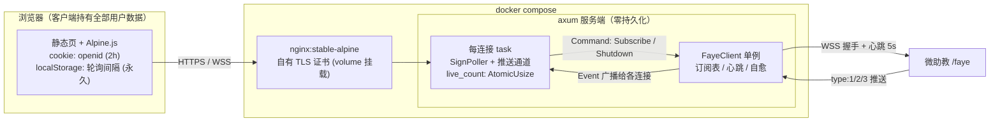
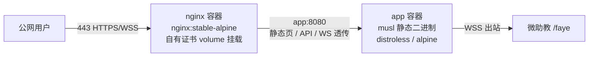
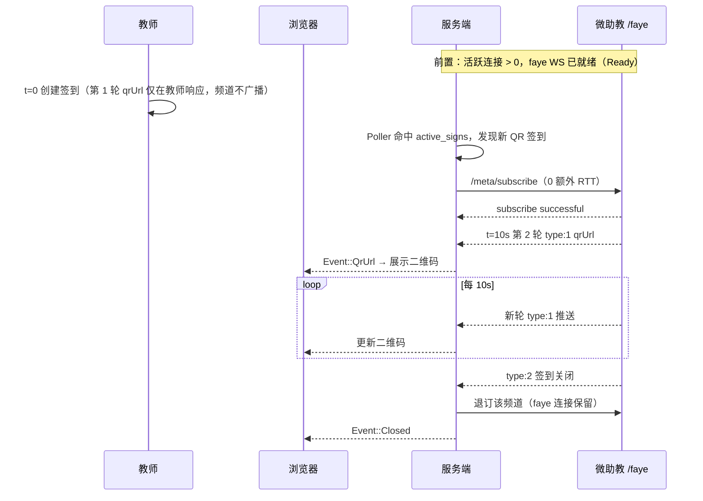

# DESIGN：微助教二维码签到工具

> 状态：定稿。协议行为均经 2026-10-08 实测确认（见 §2）。
> 存储模型：**零持久化**。所有用户数据由客户端持有，服务端内存中仅存在活跃连接的临时状态。

## 1. 目标

学生端在教师开启二维码签到后，**最快拿到可扫码的 qrUrl 并持续跟进轮换**。核心手段：

- **Faye 连接预建**：WebSocket 握手不等待签到出现，进程内有活跃连接时即保持就绪，签到出现后零 RTT 订阅。
- **全局单连接**：服务端到微助教只维护一条 faye WebSocket，承载所有连接、所有签到的订阅。
- **按需启停**：活跃连接数归零即断开 faye 连接；再次有连接时全新预建。
- **零存储**：openid 在浏览器 cookie（2h 过期），轮询间隔在浏览器 localStorage（永久）；服务端不落盘、不持久化任何用户数据，重启无损。

结构性事实（不可突破）：第 1 轮 qrUrl 仅存在于教师端创建签到响应，频道从不广播；学生端最早可得的是创建后 **T0+10s** 的第 2 轮。本设计保证订阅永远落在第一个 10s 窗口内。

## 2. 协议行为（实测确认）

### 2.1 Faye over WebSocket（服务端 → 微助教）

- 握手直接在 WS 上发 `/meta/handshake`，**无需任何 HTTP POST**，服务器返回 `clientId` 与 `advice`（`timeout:15000`）。
- 握手后**不先 connect** 直接发 `/meta/subscribe` 即返回 `successful:true`——订阅无 connect 前提。
- 连接周期由 WS 上的 `/meta/connect`（`connectionType:"websocket"`）维持；**5s 心跳**（advice timeout 的 1/3）实测稳定。
- faye 报文无身份鉴权：任何 clientId 可订阅任意频道。

### 2.2 签到频道

- 频道名 `/attendance/{courseId}/{signId}/qr`，消息 `data.type`：
  - `1`：新轮 qrUrl；
  - `2`：签到关闭；
  - `3`：前方拥挤。
- **同一连接可订阅多个频道**，互不干扰。

### 2.3 推送节拍

| 订阅完成时刻 | 首条推送 | 轮次 |
|---|---|---|
| T0+0s | T0+10.0s | 第 2 轮 |
| T0+5.3s | T0+10.0s | 第 2 轮 |
| T0+15.3s | T0+20.0s | 第 3 轮 |

- 推送严格按 `T0 + 10s × k` 广播，服务端精度毫秒级。
- 频道**无 retain 语义**：订阅成功不立即推送"当前二维码"，只等下一个节拍点；错过即整轮错过，不补发。
- 推论：订阅只要落在 T0+10s 内，首条可得时间相同；每跨过一个边界推迟 10s。

## 3. 总体架构



- **连接即会话**：浏览器与服务端之间一条 WS（`/ws`）就是一个会话。不存在会话注册表——每条连接独立 spawn 自己的 Poller 与推送通道，Event 直达对应浏览器。
- **活跃计数**：全局仅一个 `AtomicUsize` + faye 命令通道：
  - 连接建立 `fetch_add`，旧值为 0 → 触发 FayeClient 启动（幂等）；
  - 连接结束 `fetch_sub`，新值为 0 → 向 FayeClient 发 `Shutdown`。
- **零存储边界**：服务端持有的全部状态 = 活跃连接的 task、计数器、faye 订阅表（`sign_id` 集合）。

## 4. FayeClient 单例

```mermaid
stateDiagram-v2
    [*] --> Idle
    Idle --> Ready: 首条浏览器连接（fetch_add 旧值 0）\nWS 建连 + /meta/handshake
    Ready --> Subscribed: Command::Subscribe\n（订阅表去重后发送）
    Subscribed --> Ready: type:2 → 退订该频道\nfaye 连接保留
    Ready --> Idle: 最后一条连接断开（fetch_sub 新值 0）\n/meta/disconnect 尽力而为 → 关 WS → 清订阅表
    Subscribed --> Idle: 同上

    note right of Subscribed
        自愈（任意状态生效）：
        · WS 断开 → 指数退避重连（1s 起步，上限 30s）
          重连后全新 handshake + 重放订阅表
        · unknown client 类错误 → 立即重握手换 clientId
        · 心跳超时 → 视同断开走重连
        重连期间 Subscribe 在单例内排队，
        连接就绪后按序补发
    end note
```

- `Idle → Ready` 恒为全新 handshake，不复用旧 clientId——"断开期间 clientId 被服务端回收"的场景因此天然消解。
- 心跳：每 5s 发一次 `/meta/connect`（`connectionType:"websocket"`）。
- `type:1` → `Event::QrUrl { sign_id, url }`；`type:3` → `Event::Congested { sign_id }`；Event 按 sign_id 广播给所有活跃连接。

## 5. SignPoller（每连接一个）

每条浏览器连接 spawn 一个独立 tokio task：

```rust
loop {
    if subscribed {                       // 已监听到二维码（订阅表非空）
        wait_until_unsubscribed().await;  // 暂停轮询：type:2 退订后恢复
        continue;
    }
    let interval = interval_rx.borrow_and_update().max(cfg.min_poll_interval); // .env 边界钳制
    tokio::time::sleep(interval).await;
    match query_active_signs(openid).await {
        Ok(signs) => {
            for s in signs.iter().filter(|s| s.is_qr) {
                faye_tx.send(Command::Subscribe { course_id: s.course_id, sign_id: s.sign_id })?;
            }
        }
        Err(TokenInvalid) => ws_tx.send(Out::SessionExpired).await?, // 前端清理 cookie 并断开
        Err(Network) => continue,                                    // 本轮放弃，下轮重试
    }
}
```

- **订阅后暂停轮询**（2026-10-09 产品决策）：监听到二维码后不再查询 `active_signs`（省 API、避风控）；
  收到 `type:2`（签到关闭）退订、订阅表清空后恢复轮询。代价：监听 A 课期间不会发现 B 课新开的签。
- 轮询间隔**以轮为单位读取**：客户端改值最迟在当前 sleep 结束后生效——即热更新。
- 发现去重依赖 FayeClient 订阅表（§4），Poller 无状态。
- Poller 启动与 FayeClient 启动**并行**：即使首个签到在预建连完成前被发现，`Subscribe` 也在单例内排队，连接就绪后立即补发。

## 6. 服务端 ↔ 浏览器接口

| 端点 | 方向 | 说明 |
|------|------|------|
| `GET /` | HTTP | 静态页（单文件 HTML + Alpine.js） |
| `POST /api/login` | HTTP | body `{openid}` → 校验一次 `active_signs` → 签发 2h cookie；失败返回原因 |
| `WS /ws` | WS | 建立即会话开始；服务端推 `Qr` / `Closed` / `Congested` / `SessionExpired` / `Status` |
| `WS ↑ {type:"interval", seconds}` | WS | 客户端指定轮询间隔（任意时刻可改发，热更新；服务端按 `.env` 边界钳制） |
| 保活 | WS | 服务端每 30s 发 ping 帧，防反代/浏览器空闲断开 |

## 7. 前端与质量门禁

前端采用 **Alpine.js 单文件静态页**（声明式绑定，零构建链、零 Node 依赖），UI 为三个交互：登录表单、签到与二维码展示、间隔设置。`/api` + `/ws` 协议已结构化，未来 UI 复杂化可无损迁移 React。

质量门禁分层：

| 层 | 手段 | 说明 |
|----|------|------|
| 协议契约（主测试面） | **Rust 集成测试**：axum test + tokio-tungstenite 模拟浏览器客户端 | 覆盖 `/ws` 全部消息路径；前端只是协议消费者，契约锁定后前端无协议错误空间 |
| 业务规则 | 全部在服务端 | 前端保持哑渲染（展示 + 转发），可测逻辑面积最小化 |
| Lint + format | **Biome**（单二进制，无 node_modules） | `biome check static/`，与 cargo fmt/clippy 对等 |
| JS 纯函数单测 | `node --test`（Node 内置 runner） | 仅当前端存在值得测的纯函数；按哑渲染原则接近为零 |
| E2E | 不引入 | 三交互页面性价比不足；上线冒烟走部署检查清单 |

CI 顺序：`cargo fmt --check → cargo clippy -D warnings → cargo test → biome check static/ → node --test`（末步通常为空）。

## 8. 部署（Docker Compose + nginx，自有证书）



- Compose 双容器：nginx（443 → app:8080，配置 WS `Upgrade` 头、`proxy_read_timeout` 大于 30s ping 周期）+ app（仅 compose 内网，不映射公网端口）。
- app 镜像多阶段构建：cargo-chef 缓存依赖层 → `cargo build --release`（musl 静态链接）→ 运行层仅含二进制（distroless/cc 或 alpine）。
- 证书与 nginx.conf 均 volume 挂载、不进镜像；续期 = 替换文件后 `docker compose exec nginx nginx -s reload`。
- 服务端出站 WSS 在容器内直接发起，nginx 不参与出站路径。
- 零存储 + 无状态容器：升级即 `docker compose up -d`，无数据迁移。

## 9. 配置（.env）

| 环境变量 | 默认 | 说明 |
|----------|------|------|
| `LISTEN_ADDR` | `127.0.0.1:8080` | 服务监听地址（容器内） |
| `MIN_POLL_INTERVAL_MS` | `1000` | **轮询间隔下限边界**：客户端可在边界内自由指定（连接时上报 + 存续期热更新），低于边界的值在服务端读取点被钳制 |
| `FAYE_HEARTBEAT_MS` | `5000` | faye WS 心跳（依赖 advice timeout 15s） |
| `RECONNECT_BACKOFF_MAX_MS` | `30000` | faye 断线重连退避上限 |
| `WS_PING_MS` | `30000` | 浏览器侧 WS 保活 ping |

间隔数据流：客户端 localStorage（永久）→ WS 上报 → 服务端 `watch` 通道 → Poller 下轮读取 → `max(MIN_POLL_INTERVAL_MS)` 钳制。

## 10. 端到端时序（最优路径）



从"轮询发现签到"到"订阅报文离机"为 0 RTT；订阅时刻必然落在 T0+10s 窗口内（轮询延迟远小于 10s），保证拿到第 2 轮。

## 11. 风险与对策

| 风险 | 对策 |
|------|------|
| 教师创建后 10s 内关闭签到 | 第 2 轮可能不发，任何客户端实现都无法覆盖；收到 type:2 如实上报 |
| 轮询接口限频/风控 | `.env` 边界钳制下限 + 每连接独立间隔；网络错误不退避只跳轮 |
| 频道不鉴权属服务端宽松行为 | 不作为功能依赖，核心路径仅使用自己 active_signs 中发现的签到 |
| openid 明文存 cookie | 2h 短时效 + HTTPS 传输；不做服务端会话，泄露面与官方网页端一致 |
| 客户端上报超低间隔 | 服务端按 `.env` 边界钳制，不可突破 |
